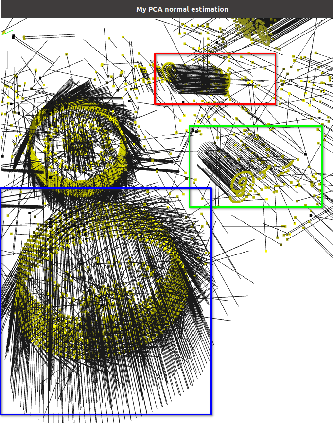
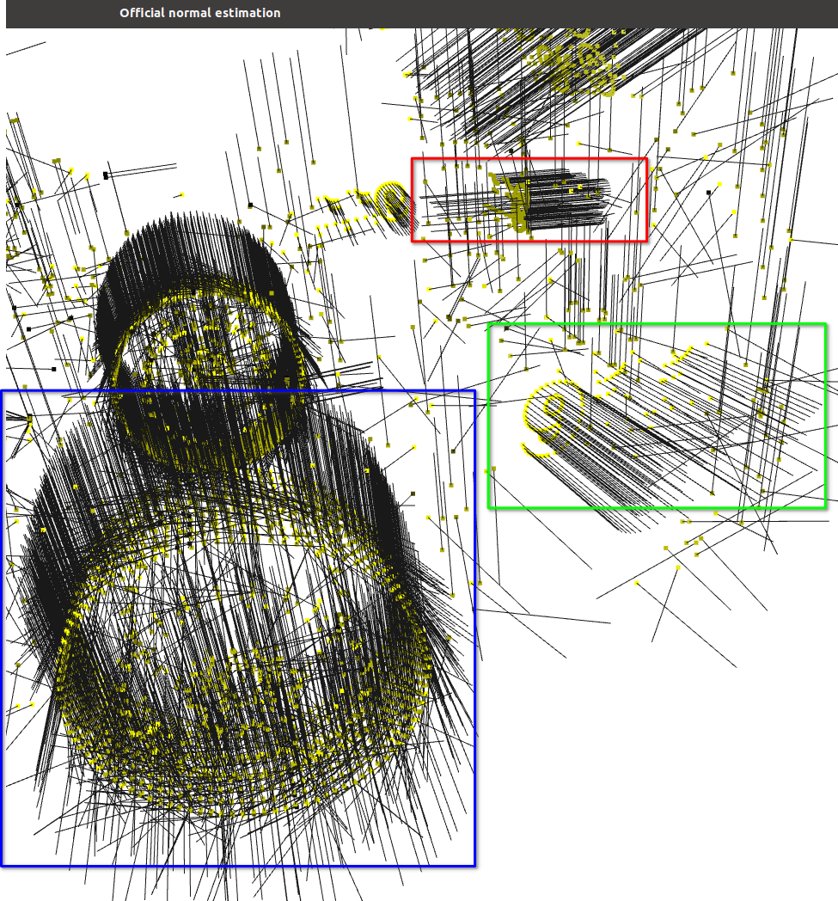
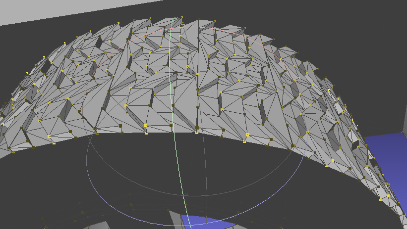
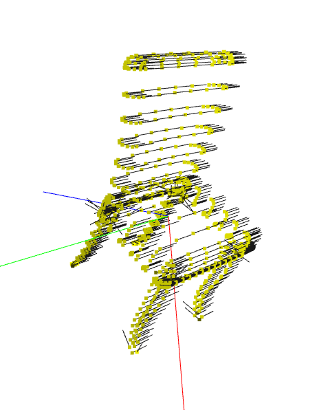
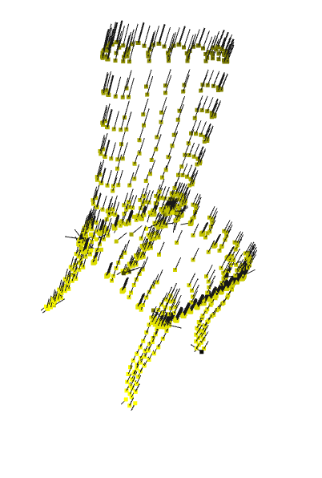
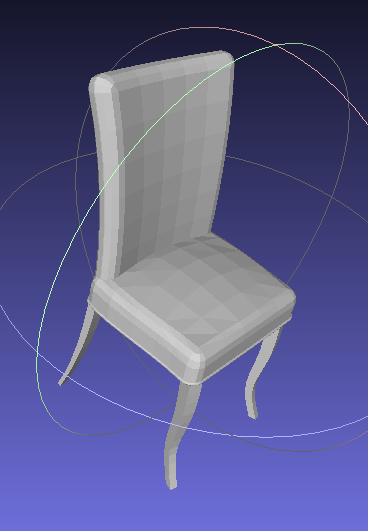
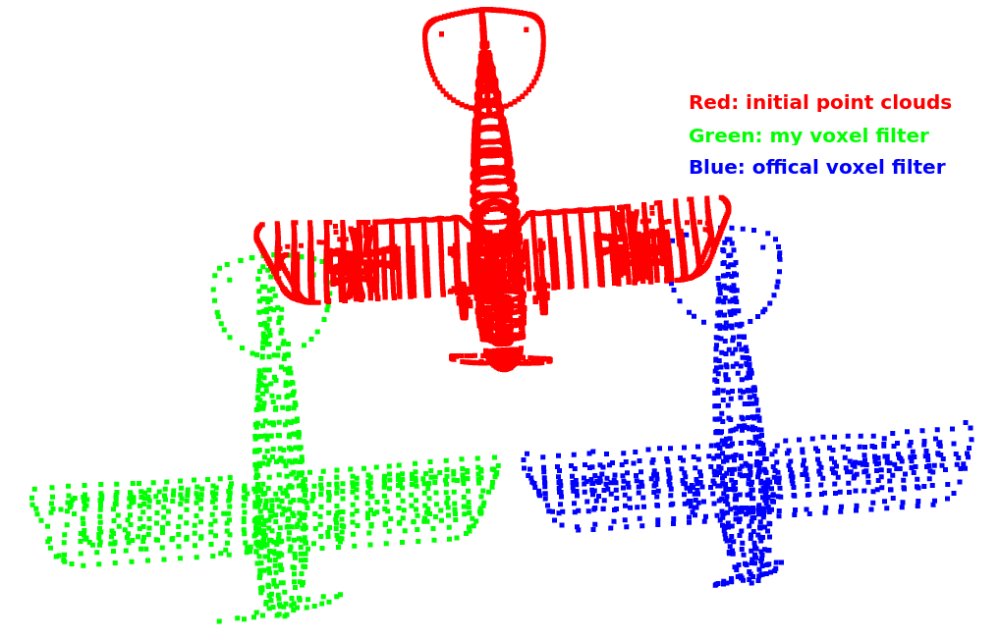

# 01-Introduciton
point clouds normal estimation and voxel filter to remove outlier.
---
# TO DO
* reason for normal estimation difference
* pseudo color rendering for normal vectors
* visualize the voxel
* hash table for voxel filter
* analysis time
# PCA_Normal_Estimation
```
python pca_normal.py -h
usage: Get PCA and surface normals for given point cloud. [-h] [-i INPUT]
                                                          [-m {official,my}]

optional arguments:
  -h, --help        show this help message and exit
  -i INPUT          Input path of point cloud in ply format.
  -m {official,my}
```
Below are the normal estimation difference between my implementation and official implementattion on `car/train/car_0001` in ModelNet40 dataset.




`chair/train/chair_0003`





## voxel filter
This implementation apply centroid in the same voxel as the result.

Below are the comparision using the same voxel size between my implementation and official implementattion on `airplane/train/airplane_0001` in ModelNet40 dataset.
```
----------------------------------------------------------------
Path: /home/steve/dataset/ModelNet40/ply_data/airplane/train/airplane_0001.ply
Model name: airplane_0001.ply
Total number of points: 90714
Voxel size: 10.0
----------------------------------------------------------------
Voxel dim DX, DY, DZ: (36, 29, 12)
Number of points after voxel filter: 957
----------------------------------------------------------------
Number of points after official voxel filter: 953
----------------------------------------------------------------
centroid difference between mine and offical methods
0.771771984556473
```

